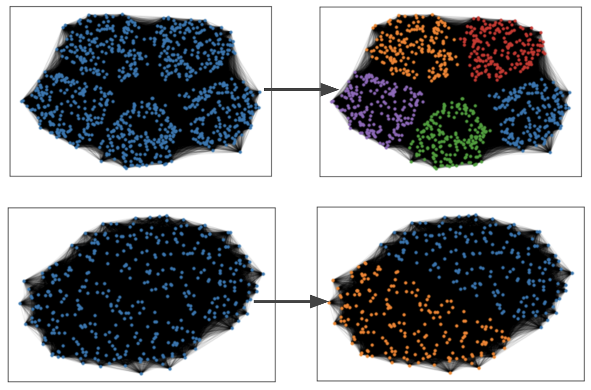
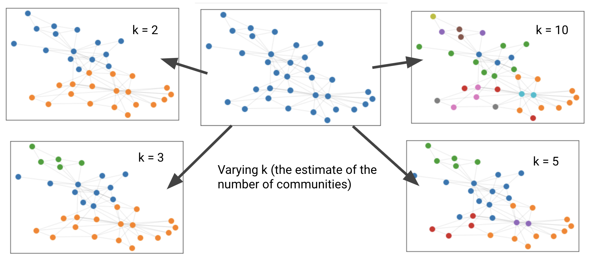

# Community Detection

A library for Community Detection in graphs.

---

### Algorithms and Usage

**Spectral Clustering**

Test on Planted L Partition Model

```python
import networkx as nx
from cdet.spectral_clustering import visualize_graph, spectral_clustering

# Color scheme
COLORS = \
    ["tab:blue", "tab:orange", "tab:green", 
     "tab:red", "tab:purple", "tab:brown", 
     "tab:pink", "tab:gray", "tab:olive", 
     "tab:cyan"]

# Create Planted L-Partition graph 
K = 5
NODES_PER_BUCKET = 200
P_IN = 0.8
P_OUT = 0.1

G_pl = nx.generators.community.planted_partition_graph(K, 
													   NODES_PER_BUCKET, 
													   P_IN, 
													   P_OUT)
pos_pl = nx.spring_layout(G_pl)

# Visualize base graph
visualize_graph(G_pl, pos_pl, edge_alpha=0.1, node_size=10, labels=False)

# Use Spectral Clustering and visualize
labels_dict = spectral_clustering(G_pl, 
                                  K, 
                                  pos_pl, 
                                  COLORS, 
                                  laplacian_type="symmetric", 
                                  edge_alpha=0.1, 
                                  node_size=10, 
                                  labels=False)
```

Some example clustering instances:



Test on Zachary’s Karate Club Network

```python
# Generate Zachary's Karate Club graph
G_kk = nx.karate_club_graph()
pos_kk = nx.spring_layout(G_kk)

# Visualize base graph
visualize_graph(G_kk, pos_kk)

# Use Spectral clustering and visualize
labels_dict = spectral_clustering(G_kk, 
								  3, 
								  pos_kk, 
								  COLORS, 
								  laplacian_type="symmetric")
```

We get the following graphs by varying the value of `k`.

